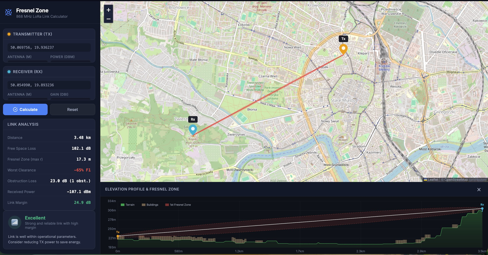

# Fresnel Zone Calculator — 868 MHz LoRa

Interactive map-based tool for calculating Fresnel zone clearance and RF link budget between two points. Built for 868 MHz LoRa (EU868) with real-world terrain elevation and building obstruction data.



## Features

- **Interactive map** — click to place Tx/Rx, drag to adjust
- **Terrain elevation** via Open-Meteo API (90m DEM)
- **Building obstruction** via OpenStreetMap / Overpass API
- **1st Fresnel zone** visualization on map and elevation profile
- **Link budget** — FSPL, diffraction loss, building penetration loss
- **LoRa spreading factors** SF7–SF12 with matching sensitivity
- Earth curvature correction (K=4/3)

## Usage

Open `index.html` in a browser or serve locally:

```bash
python3 -m http.server 8080
```

1. Click the map to place **Transmitter**
2. Click again for **Receiver**
3. Adjust antenna heights, power, and gain
4. Press **Calculate**
